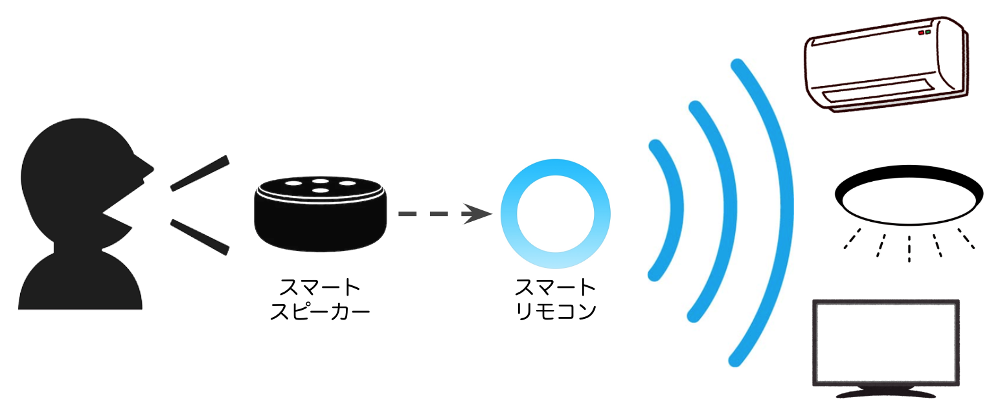

## スマートスピーカーによる家電操作

スマートスピーカーを使って音声による家電の操作をやっていきます。 スマートスピーカー対応の家電などは使用せず、リモコンによる赤外線通信で操作をする一般的な家電を音声で操作します。スマートスピーカーだけでは赤外線通信対応の家電を操作することはできないため、橋渡し役となるスマートリモコンを使用します。



##### 【準備する物】
- スマートスピーカー
    - ここでは、Amazon Echo Dot（第2世代）を使用します。
- スマートリモコン
    - ここでは、<a href="https://nature.global/jp/landing-page-dm-g/?ref=listing_ad_nature40&gclid=Cj0KCQiA4sjyBRC5ARIsAEHsELEuGy9t7e4McmrKbi7EuNRW5QwmScy_p5S-UICRZnGLcEdhIr78uRsaAiX4EALw_wcB" target="_blank">Nature Remo mini</a> を使用します。
- 家電（赤外線通信）
    - ここでは、テレビ、エアコン、シーリングライトを操作対象にします。

 

### 1 Amazon Echoの準備

Amazon Echoをいい感じのとこに設置して電源を接続してください。著者は画像のように天井近くのコンセントに壁掛けホルダーを使って設置しました。

