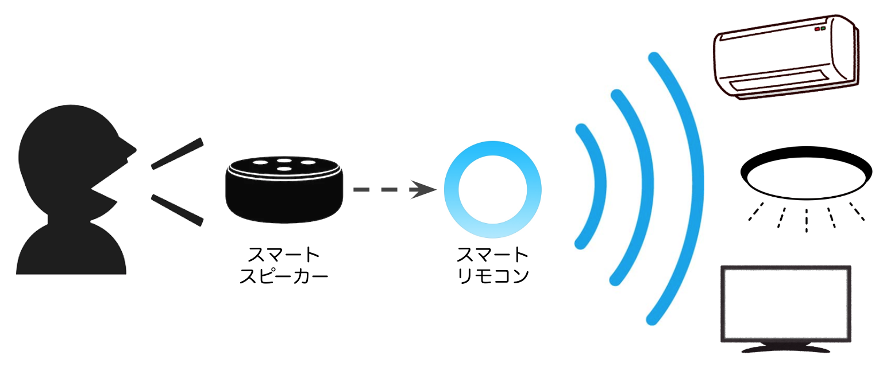

# スマートスピーカーで家電を操作してみよう！

スマートスピーカーを使って音声による家電の操作をやっていきます。 スマートスピーカー対応の家電などは使用せず、リモコンによる赤外線通信で操作をする一般的な家電を音声で操作します。スマートスピーカーだけでは赤外線通信対応の家電を操作することはできないため、橋渡し役となるスマートリモコンを使用します。

#### 【準備する物】
- **スマートスピーカー**
    - 本記事では、Amazon Echo Dot（第2世代）を使用します。
- **スマートリモコン**
    - 本記事では、<a href="https://nature.global/jp/landing-page-dm-g/?ref=listing_ad_nature40&gclid=Cj0KCQiA4sjyBRC5ARIsAEHsELEuGy9t7e4McmrKbi7EuNRW5QwmScy_p5S-UICRZnGLcEdhIr78uRsaAiX4EALw_wcB" target="_blank">Nature Remo mini</a> を使用します。
- **家電（赤外線通信）**
    - 本記事では、テレビ、エアコン、シーリングライトを操作対象にします。
- **スマートフォン**
    - 本記事では、iPhoneを使用します。
- **設定用アプリ**　※以下のアプリをインストールしてください。
    - Amazon Alexa（以下、Alexaアプリ）
        - <a href="https://apps.apple.com/jp/app/amazon-alexa/id944011620">Apple Store</a>
        - <a href="https://play.google.com/store/apps/details?id=com.amazon.dee.app&hl=ja">Google Play</a>
    - Nature Remo（以下、Nature Remoアプリ）
        - <a href="https://apps.apple.com/jp/app/nature-remo/id1193531669">Apple Store</a>
        - <a href="https://play.google.com/store/apps/details?id=global.nature.remo&hl=ja">Google Play</a>

 

<a href="text/01-alexa.md">>> 1 Amazon Echoの準備</a>
