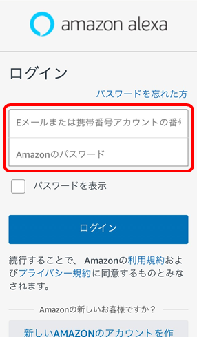
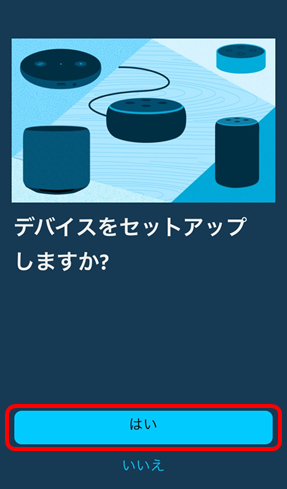
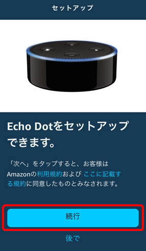
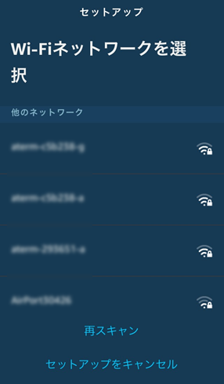
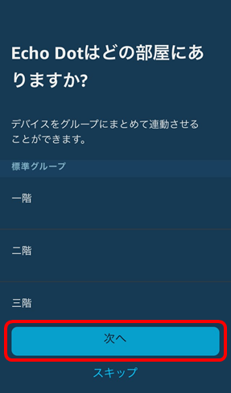
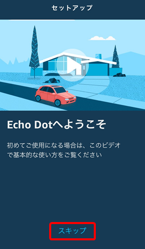
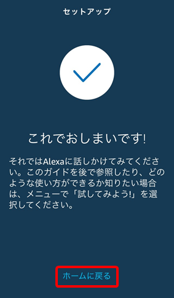
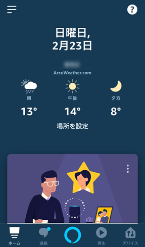

# スマートスピーカーで家電を操作してみよう！

## 1 スマートスピーカーの準備

スマートスピーカーとしてAmazon Echo Dotを使用していきます。Wi-Fiの設定などのセットアップをしていきます。まずは、Amazon Echoをいい感じのとこに設置して電源を接続してください。私は、画像のように天井近くのコンセントに壁掛けホルダーを使って設置しました。

   &emsp;
   

  続いて、インストールしたAlexaアプリを起動し、Amazonのアカウントでログインします。

   &emsp;
   

 画面の案内に従って進めていきます。

   &emsp;
   

 接続するWi-Fiを選択し、パスワードを入力してください。

   &emsp;
   

 どの部屋にありますか？の画面では、該当する場所を選択してください。ここでは、「リビング」を選択します。

   &emsp;
   

 案内に従い進めると、セットアップは完了します。

   &emsp;
   &emsp;
   

 これで、Amazon Echoを使用して音楽を聴いたり、検索したりすることができます。
