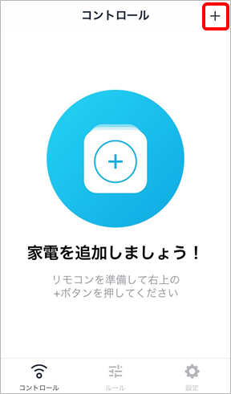
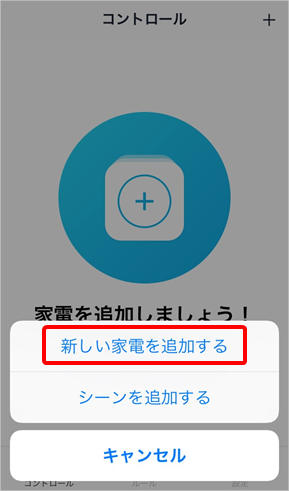
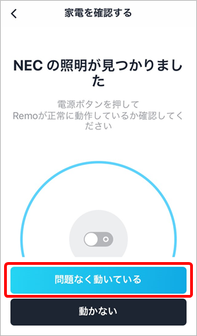
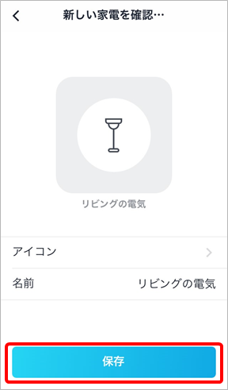
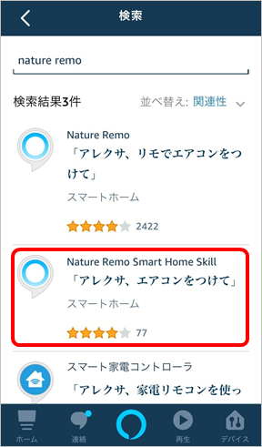
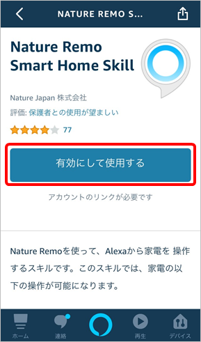
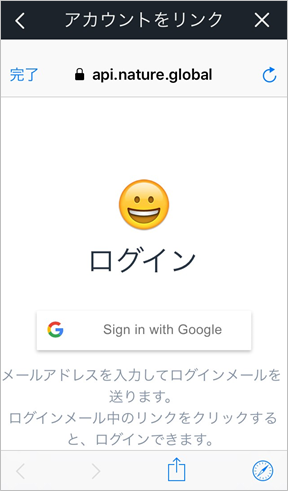
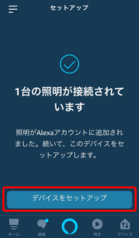
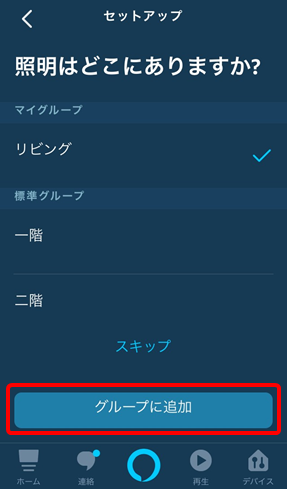

# スマートスピーカーで家電を操作してみよう！

## 2 スマートリモコンの準備

続いて、スマートリモコンの設定をしていきます。 スマートリモコンは、各家電に同梱されている赤外線通信対応のリモコンを1台のリモコンに集約できる「学習リモコン」と呼ばれるカテゴリーの製品です。スマートスピーカーと連携し、スマートスピーカーと家電の仲介役となることで、スマートスピーカー非対応の家電も音声でコントロールできるようになります。数多くのスマートリモコンがあるため、赤外線の範囲や対応センサー（温度や湿度など）をポイントに選んでください。 ここでは、<a href="https://nature.global/jp/landing-page-dm-g/?ref=listing_ad_nature40&gclid=Cj0KCQiA4sjyBRC5ARIsAEHsELEuGy9t7e4McmrKbi7EuNRW5QwmScy_p5S-UICRZnGLcEdhIr78uRsaAiX4EALw_wcB" target="_blank">Nature Remo mini</a> を使用します。Remoアプリを使って各種設定をしていきます。

Wi-Fiの初期設定などについては<a href="https://nature.global/jp/faq/setup-manual">マニュアル</a>を参考にしてください。

 

### 2.1 操作対象の家電の設定

Remoアプリを起動し、コントロール画面の右上の[＋]ボタンをタップします。操作する家電を追加していきます。

   &emsp;
   

 「新しい家電を追加する」を選択し、追加する家電のカテゴリーを選択します。 ここでは、シーリングライトを操作するため「照明」を選択します。

   &emsp;
   

 家電のリモコンをNature Remo本体に近づけて、電源ボタンを押します。 ※電源ボタンがないエアコンや照明のリモコンの場合は、冷房ボタンや全灯ボタンを押します。

&emsp;

 リモコンのボタンを押すと、対象の家電が検出されます。画面の電源ボタンを操作して正常に動作したら、[問題なく動いてる]ボタンをタップします。

 家電の名前を付けて[保存]ボタンをタップします。ここでは、「リビングの電気」という名前を付けます。

   &emsp;
   

  

### 2.2 スマートスピーカーとの連携

Remoアプリで設定した家電をAmazon Echoから操作できるように連携します。 Amazon Echo と Nature Remo を連携するためには、「**Nature Remo Smart Home Skill**」というAlexaスキルを追加する必要があります。

Alexaアプリを開き、メニューの「スキル・ゲーム」から「Nature Remo Smart Home Skill」を検索、選択します。

   &emsp;
   

 [有効にして使用する]ボタンをタップし、Nature Remoアカウントにログインします。

   &emsp;
   

 [許可する]ボタンをタップすると、Amazon Echo と Nature Remo 同士の接続が完了します。左上の[完了]をタップします。

   &emsp;
   

 接続を完了すると、自動的にデバイス検出が開始します。Remoアプリで設定した家電が検出されたら、[デバイスをセットアップ]ボタンをタップします。

   &emsp;
   

 検出された家電の追加先グループを選択します。ここでは、「リビング」を選択します。

   &emsp;
   

 グループに追加したら、連携が完了します。

   &emsp;
   

 対象のグループに家電が追加されたことが確認できます。

   &emsp;

  試しに、Amazon Echoに対して「アレクサ、電気消して」と言ってみると、シーリングライトを消してくれます。
